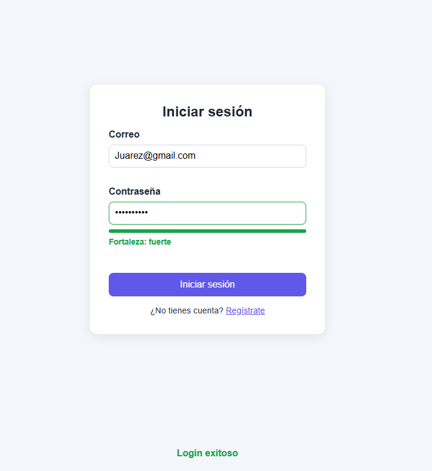

# Libreria Utileria.js

Librería de validaciones y utilidades en JavaScript puro (sin frameworks) que resuelve un problema común: **validar y formatear datos de formularios sin reescribir las mismas expresiones regulares en cada proyecto**.

 **Demo en vivo:** <https://daniiela5.github.io/utileria-js/>
 **Video:** <link video >

## Instalación

Descarga `js/utileria.js` e inclúyelo antes de tu propio script:

```html
<script src="js/utileria.js"></script>
```

Las funciones quedan disponibles globalmente.

## Funciones

### validarCorreo(correo) → boolean
Valida el formato `usuario@dominio.tld`.
```javascript
validarCorreo("daniel@gmail.com"); // true
validarCorreo("daniel@gmail");     // false
```

### soloLetras(texto) → boolean
Solo letras (con acentos y ñ) y espacios.
```javascript
soloLetras("José Pérez"); // true
soloLetras("Jose123");    // false
```

### validarLongitud(numero, maxLongitud) → boolean
```javascript
validarLongitud(12345, 6);   // true
validarLongitud(1234567, 6); // false
```

### calcularEdad(fechaNacimiento) → number
```javascript
calcularEdad("2000-05-15"); // 26 (según la fecha actual)
```

### esMayorDeEdad(fechaNacimiento) → boolean
```javascript
esMayorDeEdad("2010-01-01"); // false
```

### validarPassword(password) → boolean
Requiere mayúscula, minúscula, número, carácter especial y mínimo 8 caracteres.
```javascript
validarPassword("Hola123!"); // true
validarPassword("hola123");  // false
```

### formatearTelefono(numero) → string
Formatea 10 dígitos como `(xxx) xxx-xxxx`. Si no son 10 dígitos, devuelve el texto original.
```javascript
formatearTelefono("9511234567"); // "(951) 123-4567"
formatearTelefono("123");        // "123"
```

### medirFortalezaPassword(password) → string
Devuelve `"débil"`, `"media"` o `"fuerte"` según cuántas reglas cumple.
```javascript
medirFortalezaPassword("abc");        // "débil"
medirFortalezaPassword("Hola1234");   // "media"
medirFortalezaPassword("Hola123!");   // "fuerte"
```

## Capturas




## Video

<video>

## Autor

Daniel — <https://github.com/DaniielA5>